<br>
# Push-Out and Slide
<i>Push an object out of registered solids after you move it: minimum push-out, wall sliding, sub-stepping for fast movement, and a nearest-open-space eject. You drive the movement, this corrects it.</i> <br>
### Version 1.0.1.0

[](https://github.com/SalmanShhh/C3Addon_PushOut-and-Slide/releases/download/salmanshh_pushoutsolid-1.0.1.0.c3addon/salmanshh_pushoutsolid-1.0.1.0.c3addon)
<br>
<sub> [See all releases](https://github.com/SalmanShhh/C3Addon_PushOut-and-Slide/releases) </sub> <br>

---
<b><u>Author:</u></b> SalmanShh <br>
<sub>Made using [CAW](https://marketplace.visualstudio.com/items?itemName=skymen.caw) </sub><br>

## Table of Contents
- [Usage](#usage)
- [Examples Files](#examples-files)
- [Properties](#properties)
- [Actions](#actions)
- [Conditions](#conditions)
- [Expressions](#expressions)
---
## Usage
To build the addon, run the following commands:

```
npm i
npm run build
```

To run the dev server, run

```
npm i
npm run dev
```

## Examples Files
| Description | Download |
| --- | --- |
| PushOut example | [](https://github.com/SalmanShhh/C3Addon_PushOut-and-Slide/raw/refs/heads/main/examples/PushOut%20example.c3p) |

---
## Properties
| Property Name | Description | Type |
| --- | --- | --- |
| Enabled | Turn the whole behavior on or off. When off, the object is never pushed out of walls. You can change this while the game runs with the Set enabled action. | check |
| Resolution mode | How the object is pushed out of a wall. 'Minimum push' moves it the shortest way out (best for most games). 'Axis X only' and 'Axis Y only' push it out sideways or up and down only. 'Nearest open space' searches around for the closest free spot (slower; best used through the Eject action). | combo |
| Resolve on tick | When ticked, the object is automatically pushed out of walls every frame, right after your events move it. Untick it if you instead want to push out only at specific moments using the Resolve now action. | check |
| Enable sliding | When ticked, an object pushed against a wall keeps sliding along it instead of stopping dead. For example, walking diagonally into a wall makes the object glide along the wall rather than getting stuck. | check |
| Slide friction | How much the object slows down while sliding along a wall. 0% glides freely (like ice), 100% stops it the moment it touches a wall. Values in between feel grippy or draggy. | percent |
| Step distance | For fast moving objects. Each frame the object's movement is split into small steps of at most this many pixels, so a fast object cannot jump straight through a thin wall. Set it smaller than your thinnest wall. Leave at 0 to turn stepping off. | float |
| Obstacles | Which objects count as walls. 'Custom' uses the object types you register with the Add solid action, so each object can have its own list. 'Solids' instead uses every object that has Construct's built-in Solid behavior, with no setup needed. | combo |
| Skin width | A tiny gap, in pixels, left between the object and the wall after a push. It stops the two from being counted as touching again next frame, which can otherwise cause a 1 pixel jitter. The default of 0.5 is invisible; raise it slightly if you still see jitter. | float |


---
## Actions
| Action | Description | Params
| --- | --- | --- |
| Set max push per tick | Set the maximum length of a single correction, in pixels. Set to 0 for no limit. | Pixels             *(number)* <br> |
| Set obstacles | Choose which objects count as walls: Custom uses the types added with Add solid, Solids uses every object with the built-in Solid behavior. | Obstacles             *(combo)* <br> |
| Set resolution mode | Set how the push-out correction is computed. | Mode             *(combo)* <br> |
| Set skin width | Set the gap kept between this object and solids after a push, in pixels. | Pixels             *(number)* <br> |
| Set slide friction | Set the fraction of along-surface speed lost per resolution, from 0 (frictionless) to 1 (full stop). Values are clamped to that range. | Friction             *(number)* <br> |
| Set sliding enabled | Set whether the object slides along solid surfaces instead of stopping at them. | Enabled             *(boolean)* <br> |
| Set step distance | Set the maximum distance moved per step, in pixels. Movement is broken into steps no larger than this. Set to 0 to disable stepping. | Distance             *(number)* <br> |
| Eject to nearest open space | Search outward for the closest position where this object overlaps no solid, up to the given radius in pixels, and move it there. Triggers On ejected on success or On eject failed otherwise. | Max radius             *(number)* <br> |
| Resolve now | Run one resolution immediately, regardless of Resolve on tick. Triggers On pushed out if a correction is applied, or On became trapped if the object cannot be freed. |  |
| Set enabled | Set whether the behavior resolves. | Enabled             *(boolean)* <br> |
| Add solid | Add an object type as a solid for this object. Instances of that type will push this object out. Adding the same type twice has no effect. | Object             *(object)* <br> |
| Clear solids | Remove all object types from this object's solid registry. |  |
| Remove solid | Stop treating an object type as a solid for this object. | Object             *(object)* <br> |


---
## Conditions
| Condition | Description | Params
| --- | --- | --- |
| Is enabled | True if the behavior is enabled. |  |
| Is overlapping solid | True if this object currently overlaps at least one registered solid. |  |
| Is sliding | True if the last resolution preserved along-surface movement. |  |
| Is trapped | True if the last resolution left this object wedged against opposing solids. |  |
| On became trapped | Triggered when a resolution cannot free the object because it overlaps solids on opposing sides. OverlapCount reports how many solids it is wedged against. |  |
| On ejected | Triggered after Eject to nearest open space succeeds. LastPushX and LastPushY give the offset from the original to the ejected position. |  |
| On eject failed | Triggered when Eject to nearest open space finds no open position within the radius. The object is left at its original position. |  |
| On pushed out | Triggered after a resolution applies a non-zero correction. The LastPush, SurfaceNormal, Slide and OverlapCount expressions describe the correction just applied. |  |
| On step | Triggered for each step this object moves in, when stepping is enabled. Use it to make additional collision tests during fast movement. StepIndex and StepCount are available, and the object is at the current step's resolved position. |  |
| Is solid | True if the given object type is registered as a solid for this object. | Object *(object)* <br> |


---
## Expressions
| Expression | Description | Return Type | Params
| --- | --- | --- | --- |
| ResolutionMode | The current resolution mode key (minimum_push, axis_x, axis_y or nearest_open). | string |  | 
| LastPushDistance | The length of the last correction, in pixels. 0 if the last resolution moved nothing. | number |  | 
| LastPushX | The X distance of the last correction, in pixels. | number |  | 
| LastPushY | The Y distance of the last correction, in pixels. | number |  | 
| OverlapCount | The number of distinct solids the object overlapped at the last resolution. | number |  | 
| SlideDistance | The length of the along-surface movement preserved at the last resolution, in pixels. | number |  | 
| SlideX | The X distance of the along-surface movement preserved at the last resolution, in pixels. 0 if no sliding occurred. | number |  | 
| SlideY | The Y distance of the along-surface movement preserved, in pixels. | number |  | 
| StepCount | The number of steps the object moves in during the current tick. 1 when stepping is disabled. | number |  | 
| StepIndex | The index of the current step, starting at 0. Meaningful inside On step. | number |  | 
| SurfaceNormalX | The X component of the unit surface normal the object was pushed off (the push-out direction). 0 if nothing moved. | number |  | 
| SurfaceNormalY | The Y component of the unit surface normal. Use with SurfaceNormalX to detect which side a wall is on. | number |  | 
| GetSolidByIndex | The name of the registered solid object type at the given 0-based index. | string | Index *(number)* <br> | 
| SolidCount | The number of object types currently registered as solids. | number |  | 


---
## Changelog

**1.0.1.0**

**1.0.0.0**

**0.0.0.0**
- **Added:** Initial release.
